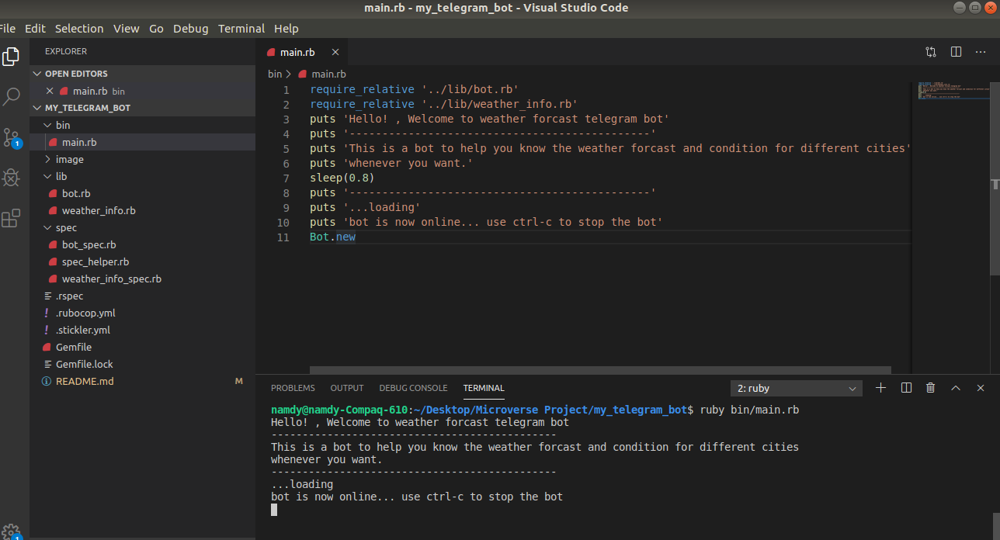
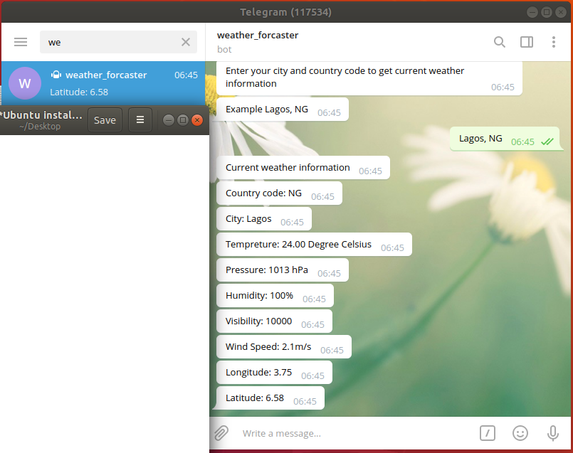
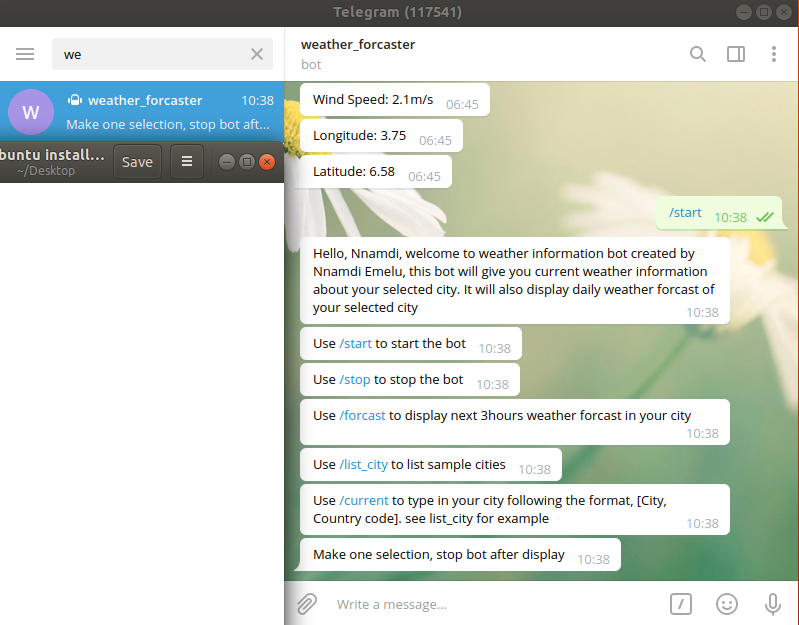
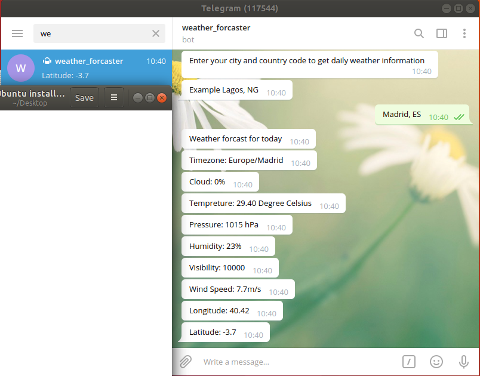
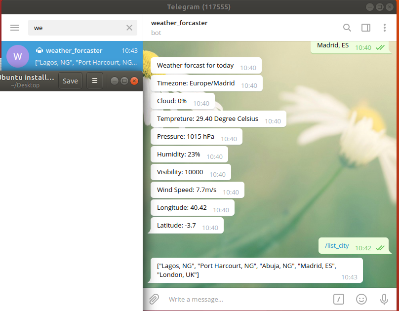
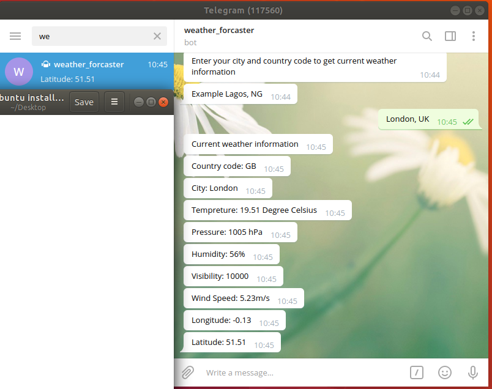
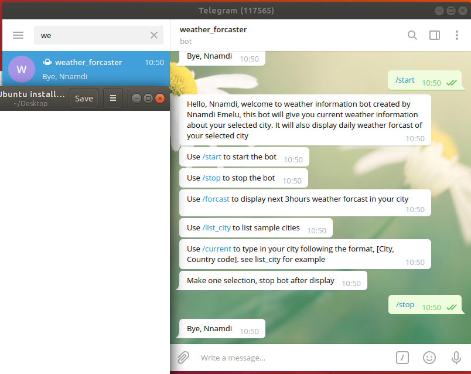

# Weather Forcaster Telegram bot
This project aims to make a telegram bot that gives information about current weather and daily weather forecast for a selected city. The project was built using ruby language.

My major driving force to implement this project is to simplify the process of getting accurate current and daily weather reports of major cities around the world just by entering the city in the telegram app installed on your device.
This project calls OpenWeather API to retrieve information for current weather or daily weather forecast for the chosen city. You need to provide the name of the city and your country code when prompted by the telegram app. This bot will also help you identify your two-letter country code if you do not know it. Information for all the major cities in the OpenWeather database can be retrieved. This project helps you to know your current weather report easily from the telegram app installed on your device any time of the day.

## Main Features Of This Bot
- It can display an array of sample cities you can follow when entering your city.
- It can display current weather information of selected city specifying details such as temperature, pressure, latitude, longitude, wind speed, humidity, visibility, your city, and country code.
- It can display daily weather forecasts with the same details specified above including cloud state.
- Bot shows a link that will display a List of ISO 3166 two-letter country codes.
- Bot works in a telegram app installed on devices like computers, mobile phones, and tablets.

## Prerequisite for Using this Bot and Getting Ready (Local setup)
- Ensure the telegram app is installed on your device and you have a telegram account.
- Ensure Ruby is installed on your computer.
- Create a bot token by following the guide [here](https://core.telegram.org/bots#6-botfather). 
- Fork this project and clone it into your local machine/computer.
- From your terminal change directory (cd) into my_telegram_bot folder.
- Install ruby gems by running "bundle install" on your terminal.
- Run 'ruby bin/main.rb' on your terminal to start the bot.
- Enter cntrl and C to stop the bot.
- Open Telegram and start talking with @weather_forcaster.

## How to Use
- Type 'ruby bin/main.rb' in your terminal to start the telegram bot.
- Launch your telegram app, type 'weather_forcaster' in your search bar, and click on it to initiate communication with it.
- Type '/start' in your telegram and press enter to display the user guide
- Type '/forcast' in telegram and press enter, enter city e.g Tokyo, JP to display the days' weather forcast for the city. 
- Type '/list_city' in telegram and press enter, to display a sample list of cities. . Follow the guide to identify your country code if you do not know it.
- Type '/current' in telegram and press enter, enter the city to display current weather information for the specified city. 
- Type cntrl and C in your terminal to end the bot first. Then type '/stop' in your telegram app and press enter to end the operation. 

## Live Version
This bot has been deployed to Heroku. It is expected to be running without the local setup unless there is a need to log into the app for maintenance by me.
However, you can access the live link below.
- [Launch App](https://stark-reaches-70789.herokuapp.com/)
- Follow the steps below
      - Launch the Telegram app on your computer, mobile phone, or tablet.
      - In your search bar, type weather_forcaster, click on it to launch this bot.
      - Type /start on your message box, submit and follow the instructions to use this bot.

## Built With
- Ruby version 2.6.5.
- Telegram/bot
- Rspec for testing
- Hosted on Heroku
- [OpenWeather API](https://openweathermap.org/api)

## Author

👤 **Nnamdi Emelu**
- Github: [@githubhandle](https://github.com/zubenna)
- Twitter: [@twitterhandle](https://twitter.com/zubenna)
- Linkedin: [linkedin](https://linkedin.com/in/nnamdi-emelu-08b14340/)

## 🤝 Contributing
Contributions, issues and feature requests are welcome!

Feel free to check the [issues page](https://github.com/Zubenna/my_telegram_bot/issues)

## Show your support
Give a ⭐️ if you like this project!

## Acknowledgments
- Project inspired by Microverse Program

